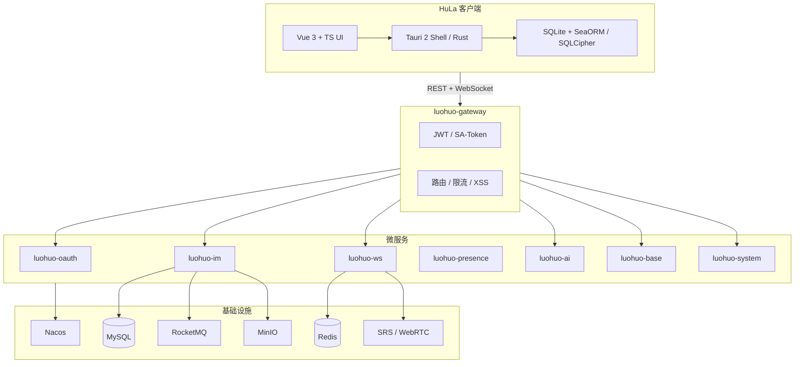

# HuLa 项目技术栈与功能分析

HuLa 是一套**跨平台即时通讯（IM）**产品，采用 **Monorepo** 组织：主路径是 **Tauri 客户端**（`HuLa/`）+ **Spring Cloud 服务端**（`HuLa-Server/`）。客户端通过 HTTP（`/api`）与 WebSocket（`/api/ws/ws`）与后端通信；云端模式下服务端是消息投递与历史的权威来源，客户端用本地 SQLite 做缓存与离线能力。

---

## 一、整体架构

| 目录 | 角色 |
|------|------|
| `HuLa/` | 主客户端：桌面 + 移动端 |
| `HuLa-Server/` | IM 与 AI 后端微服务 |
| `HuLa-Electron/` | Electron 版壳（辅助，非默认） |
| `HuLa-MCP/` | MCP 服务，供 LLM 访问 IM 上下文与工具 |

---

## 二、技术栈详解

### 1. 客户端（HuLa）

#### 应用壳与跨平台

| 技术 | 用途 |
|------|------|
| **Tauri v2** | 轻量跨平台壳：Windows / macOS / Linux / Android / iOS |
| **Rust** | 原生能力：WebSocket、HTTP、本地 DB、截图、托盘、多窗口等 |
| **Tauri 官方插件** | 剪贴板、对话框、FS、HTTP、通知、全局快捷键、SQL、更新、扫码等 |
| **tauri-plugin-hula** | 项目自定义移动端插件 |
| **tauri-plugin-mic-recorder** | 语音录制 |

#### 前端

| 技术 | 用途 |
|------|------|
| **Vue 3** + **Composition API** | UI 框架 |
| **TypeScript** | 类型安全 |
| **Vite 8** | 构建与 HMR（README 标 Vite 7，当前 `package.json` 为 8.x） |
| **Vue Router 5** | 路由；桌面/移动分套路由 |
| **Pinia** + **persistedstate** + **shared-state** | 全局状态与持久化 |
| **Naive UI** | 桌面端组件库 |
| **Vant** | 移动端组件库 |
| **UnoCSS** + **Sass** | 原子化样式 + 主题变量 |
| **vue-i18n** | 国际化（约 98% 完成） |

#### 客户端特有能力库

| 库 | 用途 |
|----|------|
| **tokio-tungstenite** | Rust 侧 WebSocket |
| **reqwest** | HTTP 客户端 |
| **SeaORM** + **SQLite** | 本地 ORM；可选 **SQLCipher** 加密 |
| **rodio** | 音频播放 |
| **@vue-office/** | 在线预览 docx/xlsx/pdf/pptx |
| **mermaid / stream-markdown / monaco** | Markdown、代码块渲染 |
| **three.js** | 3D 相关展示 |
| **tlbs-map-vue** | 腾讯地图（位置消息） |
| **hula-emojis** | 表情包 |
| **crypto-js / fingerprintjs** | 加密与设备指纹 |
| **Vitest** + **Biome** + **Husky** | 测试、Lint、提交规范 |

#### 工程与发布

- **pnpm** 包管理；**Commitizen** / **release-it** 发版
- 桌面：**多窗口**、系统托盘、自动更新、全局快捷键
- 文件：七牛云上传（README）；配置在 `configuration/local.yaml`

---

### 2. 服务端（HuLa-Server）

#### 核心框架

| 技术 | 版本/说明 |
|------|-----------|
| **Java 17** | 编译目标（`luohuo-parent`） |
| **Spring Boot 3.4.4** | 应用框架 |
| **Spring Cloud 2024.0.1** | 微服务治理 |
| **Spring Cloud Alibaba 2023.0.1.2** | Nacos 等 |
| **Maven** | 多模块构建（`luohuo-cloud`、`luohuo-util`） |

#### 微服务模块（`luohuo-*`）

| 模块 | 职责 |
|------|------|
| **luohuo-gateway** | 统一入口、鉴权、路由、限流熔断、XSS |
| **luohuo-oauth** | 登录、Token、扫码、会话 |
| **luohuo-base** | 多租户、组织、RBAC |
| **luohuo-im** | 好友、群组、消息、会话 |
| **luohuo-ws** | WebSocket、推送、WebRTC 信令 |
| **luohuo-presence** | 在线状态 |
| **luohuo-ai** | 多模态 AI（对话/图/音/视频） |
| **luohuo-system** | 后台配置、审计、统计 |
| **luohuo-generator** | 代码生成 |
| **luohuo-support** | 监控、Boot 聚合等 |

#### 数据与中间件

| 技术 | 用途 |
|------|------|
| **MySQL 8** | 用户、消息、租户等业务数据 |
| **Redis** | 会话、缓存、路由表 |
| **RocketMQ 5.3** | 服务解耦、事务/顺序消息 |
| **Nacos** | 注册发现 + 配置中心 |
| **MyBatis-Plus** | ORM |
| **Dynamic Datasource** | 多租户分库 |
| **MinIO** | 对象存储（本地 Docker） |
| **Netty + WebFlux** | `luohuo-ws` 高并发长连接 |
| **SRS** | 流媒体；配合 WebRTC 音视频 |

#### 安全与平台能力

- **SA-Token** + **OAuth2/JWT** 鉴权
- **luohuo-xss-starter**、验证码、分布式事务（Seata）、**XXL-Job** 等 starter（`luohuo-util`）
- 对象存储对接：**七牛、腾讯云 COS、华为 OBS** 等（parent POM 依赖）
- 微信 SDK（`weixin-java`）等扩展登录/生态

#### AI 技术栈

- **Spring AI** 统一抽象（Chat/Image/Audio/Video Model）
- 对接 **OpenAI、DeepSeek、Kimi、通义、文心、智谱、Gitee AI、硅基流动、Ollama、Midjourney、Suno** 等
- **TinyFlow** 工作流编排复杂 AI 场景

#### 本地开发基础设施（Docker）

`HuLa-Server/docs/install/docker/docker-compose.yml` 一键拉起：

- Nacos、MySQL、Redis、RocketMQ（含 Proxy）
- MinIO、SRS（WebRTC/RTMP）
- Jenkins（可选 CI）

网关开发端口示例：`18760`（见客户端 `local.yaml`）。

---

### 3. 辅助子项目

| 项目 | 技术 | 作用 |
|------|------|------|
| **HuLa-Electron** | Electron + Vue + TS | IM 的 Electron 替代壳 |
| **HuLa-MCP** | TypeScript + Express + MCP SDK + Zod | 为 LLM 提供用户/群/消息资源与发消息等工具 |

---

## 三、消息与通信模型（技术实现要点）

1. 客户端经 **Gateway** 调 **IM 服务** 落库。
2. **PushService** 查路由表，定位用户所在 **WS 节点**（指纹级设备映射，非广播风暴）。
3. 经 **RocketMQ** 主题投递到目标 WS 节点。
4. WS 推送到客户端；客户端 **ACK** 后更新已送达状态。

该设计强调：**O(k) 精准路由**、节点水平扩展、低延迟推送（README 称平均 &lt;50ms 量级目标）。

---

## 四、系统实现了什么功能

下面按**用户可见能力**与**平台/运维能力**归纳（以客户端 README 功能表 + 服务端模块 + 路由/代码为准）。

### 1. 用户与认证

- 账号密码登录、**二维码扫码登录**、多设备登录管理
- 注册、忘记密码、远程登录提醒
- 服务端：手机/邮箱等多种登录方式、Token 刷新、分布式会话

### 2. 即时通讯核心

- **单聊 / 群聊**、实时 WebSocket 推送
- **消息撤回**、**@提醒与回复**、**已读状态**
- **历史记录**、聊天记录搜索、多选转发（`multiMsgWindow`）
- **表情包**、链接预览卡片、消息点赞、右键菜单
- 富媒体：图片/文件/语音等；**七牛云**（及 MinIO 等）上传
- 离线消息与系统通知、托盘/程序坞角标

### 3. 社交与群组

- 好友添加/删除/搜索、备注昵称、**黑名单/免打扰**
- **群组**创建、成员管理、邀请、群公告（含移动端编辑/列表）
- **好友在线状态**、徽章系统
- **扫码**登录、进群
- **位置**获取与发送（腾讯地图）

### 4. 朋友圈（社区动态）

- 发布动态、详情页、点赞/评论通知（WebSocket 事件）
- 未读角标与全局通知
- 相册、分享、发布入口

### 5. 音视频与实时协作

- **语音通话 / 视频通话**
- 服务端：**WebRTC P2P** + **SRS** 流媒体基础设施
- 桌面：**共享屏幕**

### 6. AI 能力

- 客户端：**AI 助手**、机器人插件（对话、文生图、文生视频等）
- 服务端：**luohuo-ai** 统一多平台对话、文生图/音/视频、模型额度、工作流

### 7. 客户端体验与系统功能

- **深色/浅色主题**、皮肤切换
- **多窗口**（聊天、图片/视频查看、文件管理、邮件、关于、更新等）
- **截图**、图片查看器、Office/PDF 预览
- **全局快捷键**、锁屏、网络设置
- **自动更新**（`tauri-plugin-updater`）
- **i18n**（进行中）
- 邮件窗口、在线状态窗口、文件管理器等扩展 UI

### 8. 服务端管理与平台

- **多租户**、组织架构、RBAC 权限
- IM 参数配置、用户封禁、**内容审计**
- 活跃度与消息量统计、**Spring Boot Admin** 监控
- 代码生成器（`luohuo-generator`）加速 CRUD 开发

### 9. 明确未支持或辅助范围

- **纯 Web 浏览器版**：README 标明暂不支持（需去掉桌面专用能力）
- **HuLa-Electron / HuLa-MCP**：非主路径，分别为替代壳与 AI 集成

---

## 五、总结

| 维度 | 结论 |
|------|------|
| **产品定位** | 企业级/消费级 IM + 社交动态 + AI 助手，全端（桌面+移动） |
| **客户端技术** | Tauri 2 + Vue 3 + Rust + 本地加密 SQLite，偏「原生 IM 客户端」而非网页 |
| **服务端技术** | Spring Cloud 微服务 + Netty/WebFlux WS + MySQL/Redis/RocketMQ/Nacos，可 Docker 本地全栈 |
| **差异化** | 精准 WS 路由、多模态 AI 深度集成、朋友圈、跨平台一套代码 |
| **架构来源** | 服务端设计参考 **lamp-cloud**（README 致谢） |

---

## 参考

- [CONTEXT-MAP.md](../CONTEXT-MAP.md)
- [HuLa/CONTEXT.md](../HuLa/CONTEXT.md)
- [HuLa-Server/CONTEXT.md](../HuLa-Server/CONTEXT.md)
- [HuLa/README.md](../HuLa/README.md)
- [HuLa-Server/README.md](../HuLa-Server/README.md)
