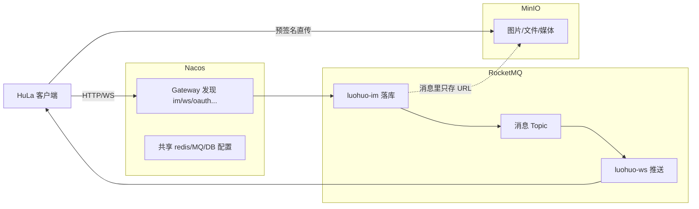

# Nacos、RocketMQ、MinIO 在 HuLa 中的作用

本文说明 HuLa-Server 本地 Docker 栈中 **Nacos**、**RocketMQ**、**MinIO** 三个组件分别承担什么职责，以及它们与 IM 业务的关系。

> 三者都是 **HuLa-Server 的基础设施**，与 MySQL、Redis 一起在 `HuLa-Server/docs/install/docker/docker-compose.yml` 中启动。它们**不参与客户端 UI**，但分别解决「服务怎么找、消息怎么传、文件放哪」三件事。

---

## 1. Nacos — 微服务的「通讯录 + 配置中心」

### 在 HuLa 里做什么

每个微服务（gateway、im、ws、oauth、ai、system 等）启动时都会在 `bootstrap.yml` 里连接 Nacos，主要承担两件事：

| 能力 | 作用 |
|------|------|
| **服务发现（Discovery）** | 各服务注册自己的 IP/端口；**网关**按服务名把请求转到 `luohuo-im`、`luohuo-ws` 等，而不是写死地址。 |
| **配置中心（Config）** | 从 Nacos 拉取共享配置：`common.yml`、`redis.yml`、数据库配置、`rocketmq.yml` 等；修改配置可热更新，不必在每个 jar 里各写一份。 |

WS 服务还会用 Nacos 做**节点级会话管理**：`NacosSessionRegistry` 将当前 WS 节点注册到 Nacos，并配合 Redis 维护「用户连在哪个 WS 节点」，供消息路由使用。

配置示例（各服务 `bootstrap.yml` 中类似结构）：

```yaml
spring:
  cloud:
    nacos:
      config:
        shared-configs:
          - dataId: common.yml
          - dataId: redis.yml
          - dataId: rocketmq.yml
      discovery:
        server-addr: ${luohuo.nacos.ip}:${luohuo.nacos.port}
```

### 可以怎么理解

- **没有 Nacos**：微服务不知道彼此在哪，网关无法动态路由，配置也难统一。
- **有 Nacos**：Spring Cloud 微服务能「自动组网」，本地/多机部署时换 IP 也不用改代码。

**客户端不直接连 Nacos**，只连网关（如 `http://host:18760/api`）。

---

## 2. RocketMQ — 服务之间的「异步邮筒」（IM 推送的核心管道）

### 在 HuLa 里做什么

IM 是**多进程**架构：`luohuo-im` 负责落库和业务，`luohuo-ws` 负责长连接推送。两者通过 RocketMQ **解耦、异步、可水平扩展**。

### 典型消息链路

（与 HuLa-Server README 中的消息流程一致）

```text
客户端 → 网关 → IM 服务（消息入库）
              ↓
         发到 MQ（如 msg_push_output_topic）
              ↓
         IM 消费后查在线用户、查路由表
              ↓
         发到 websocket_push（及按节点分的 websocket_push{nodeId}）
              ↓
         目标 WS 节点消费 → 推送到具体 WebSocket 连接
```

### 主要 Topic（`MqConstant`）

| Topic | 用途 |
|-------|------|
| `frontend_msg_input_topic` | 前端消息进入 IM 的异步处理 |
| `msg_push_output_topic` | IM 落库后进入推送流水线 |
| `websocket_push` | 全局路由层：决定推给哪些用户 |
| `websocket_push{nodeId}` | **按 WS 节点** 的专属队列（`PushConsumer` 只消费本节点） |
| `websocket_push_delay` | 延迟重推（ACK 失败时重试） |
| `msg_push_ack_topic` / `msg_push_read_topic` | 已送达确认、已读回执 |
| `user_login_send_msg` / `user_scan_send_msg` | 登录、扫码登录相关通知 |

相关代码位置：

- Topic 定义：`luohuo-common/.../MqConstant.java`
- 节点消费：`luohuo-ws-biz/.../PushConsumer.java`
- 消息发送消费：`luohuo-im-biz/.../MsgSendConsumer.java`
- 可靠发送工具：`luohuo-transaction-starter/.../MQProducer.java`（支持事务提交后发送、延迟消息）

### 可以怎么理解

- **没有 RocketMQ**：IM 要同步调用每一个 WS 节点，耦合高、扩 WS 节点困难，峰值容易拖垮 IM。
- **有 RocketMQ**：IM 只负责「把消息投进邮筒」；哪个 WS 节点有用户在线，由路由 + **节点专属 Topic** 精准投递（README 中的「精准路由模式」）。

---

## 3. MinIO — 对象存储（图片、文件、音视频等「大文件」）

### 在 HuLa 里做什么

MinIO 是 **S3 兼容** 的对象存储。在 HuLa 里它**不是消息队列，也不做服务发现**，只负责**存文件、提供访问地址**。

系统通过 `luohuo-system` 的存储抽象 `StorageDriver` 支持多种引擎；本地 Docker 默认会起一个 MinIO，生产也可换成七牛、阿里云 OSS 等：

| 配置/接口 | 说明 |
|-----------|------|
| `storageDefault` | 系统配置，可为 `minio` 或 `qiniu` 等 |
| `GET /anyTenant/ossToken` | 按引擎返回上传凭证：MinIO 返回**预签名 PUT URL**，七牛返回 upload token |
| 对象路径 | 如 `chat/{时间戳}_{文件名}`，用于聊天图片、附件、头像等 |

核心实现：

- `luohuo-system-biz/.../StorageDriver.java` — 按引擎分发
- `luohuo-system-biz/.../MinioStorage.java` — 生成 MinIO 预签名 URL
- `luohuo-system-controller/.../IndexController.java` — `ossToken` 接口

`luohuo-ai` 生成的图片/音频/视频也会走统一文件存储体系（不限定必须是 MinIO，但本地开发常用 MinIO）。

Docker 中 `minio-mc` 会初始化 bucket（如 `dev`）。

### 可以怎么理解

- **MySQL**：存消息元数据、用户、关系（结构化、可查询）。
- **MinIO**：存二进制大对象（非结构化、按 URL 访问）。
- 客户端 README 中的「七牛云上传」是**同一种能力**的另一种存储后端；本地开发常用 MinIO 代替云 OSS。

---

## 三者在一套 IM 里的分工



| 组件 | 一句话 |
|------|--------|
| **Nacos** | 微服务互相找到 + 统一配置 |
| **RocketMQ** | IM 与 WS 之间异步、可扩展的实时推送管道 |
| **MinIO** | 聊天/AI 等大文件的存储与直传 |

---

## 本地 Docker 端口参考

（以 `docker-compose.yml` 为准，实际以本机配置为准）

| 组件 | 常见端口 |
|------|----------|
| Nacos | 8848（API）、8080（控制台） |
| RocketMQ NameServer | 9876 |
| RocketMQ Proxy | 8082 |
| MinIO | 9000（API）、9001（控制台） |

客户端开发配置见 `HuLa/src-tauri/configuration/local.yaml`（`base_url`、`ws_url` 指向网关，不直连上述组件）。

---

## 参考

- [HuLa-Server/README.md](../HuLa-Server/README.md) — 消息流程、WS 性能对比
- [HuLa-Server/CONTEXT.md](../HuLa-Server/CONTEXT.md) — 服务端术语
- [HuLa项目技术栈与功能分析.md](./HuLa项目技术栈与功能分析.md) — 整体技术与功能概览
