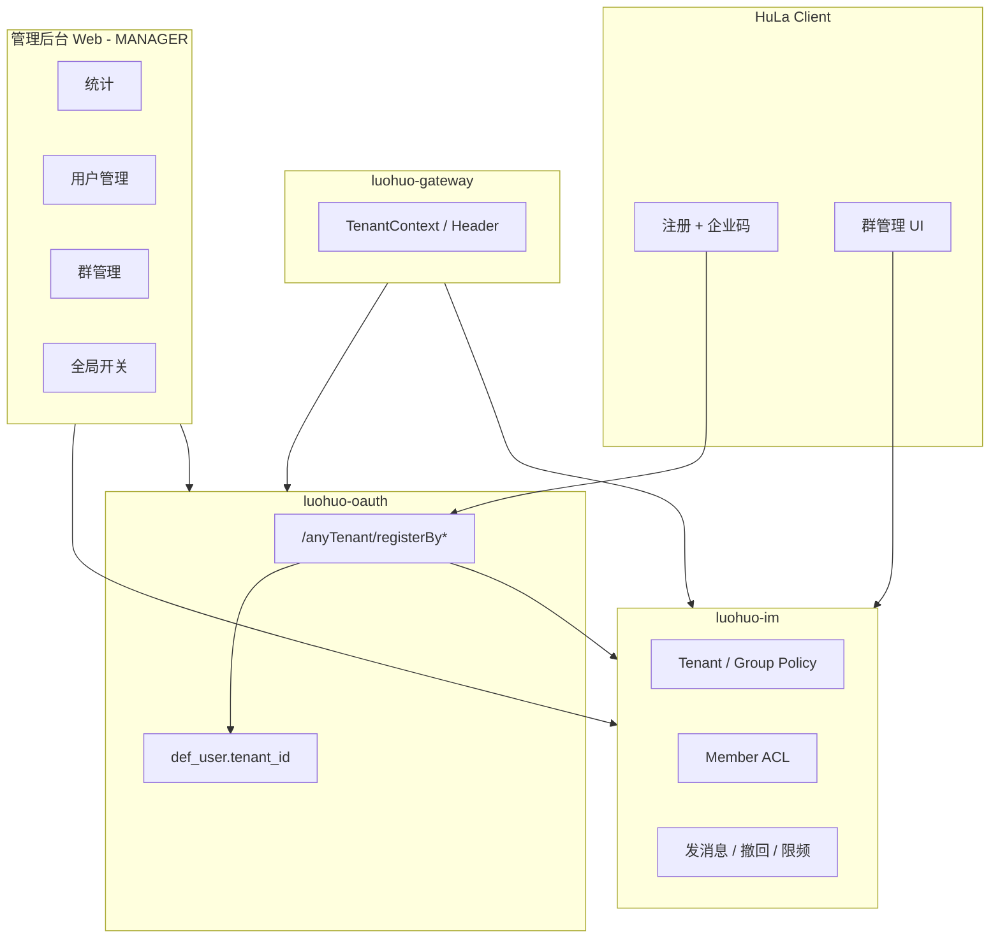

# 企业码多租户与群管理实现分析

> 基于 HuLa 代码库（`HuLa-Server` + `HuLa` 客户端）的架构分析，**不改代码**，说明需求如何实现：哪些能力已有、哪些要新建，以及推荐的分层与落地顺序。

---

## 一、总体判断

需求本质是：**以「企业码（邀请码）」为边界的 B2B 多租户 IM**，叠加 **租户级策略**、**群级策略**、**成员级 ACL**，以及 **租户隔离的管理后台**。

**现状：**

- 服务端已有较完整的 **Tenant 基础设施**（`def_tenant`、`tenant_id` 字段、`luohuo-tenant` 拦截器、`def_tenant.website` 域名绑定）。
- **缺口**：没有把「企业码」接到注册链路，也没有租户内社交隔离、群治理细粒度配置、以及完整的 IM 运营后台。



---

## 二、现有能力与缺口对照

| 需求域 | 已有 | 缺口 |
|--------|------|------|
| 注册必填企业码 | OAuth 注册：`registerByMobile/Email`，`UserRegisterVo.tenantId` | 注册 VO 无邀请码；`DefUserServiceImpl` **写死 `tenantId=1L`** |
| 用户只属于该企业 | `im_user.tenant_id`、`def_user.tenant_id` | 注册未按码绑定；无「换企业」业务（一般也不应支持） |
| 同企业才能加好友（可开关） | `im_user_privacy.allow_add_friend`（用户级） | 无**租户级**开关；`ApplyServiceImpl` **未校验 tenant 一致** |
| 群聊同上 | 群、成员表均有 `tenant_id` | 建群/拉人/搜群未强制同租户 |
| 群管理（APP） | 群主/管理员 `role_id` 1/2/3；设/撤管理员；踢人；`allow_scan_enter`；撤回（群主/管理员任意消息，本人 2 分钟内） | 无成员禁言、群禁言、发言频率、加群方式、历史可见、群内外加好友/改昵称、**编辑已发消息**、按人授权编辑/撤回 |
| 管理后台 | `AdminStatsController`；群分页/解散/踢人（部分标注后台专用）；`DefUserController` 强制注销；`base_config` | 无完整用户 CRUD/封禁/注销审计；无全局 IM 开关 UI；无「每企业独立后台」产品化；**本 monorepo 未见独立 Admin 前端**（应在 `systemType=MANAGER` 那套 Web） |
| 多租户 + 多域名 | `def_tenant.website`；`TenantContextWebFilter` 读 `HEADER_TENANT_ID` | 缺「域名 → tenant」解析；缺邀请码与 tenant 映射 |

---

## 三、核心模型建议（术语对齐 CONTEXT）

建议统一词汇（可写入 `HuLa-Server/CONTEXT.md`）：

| 术语 | 含义 |
|------|------|
| **Tenant（租户）** | 一个企业组织，对应 `def_tenant.id` |
| **Enterprise code（企业码）** | 注册/加入时使用的邀请码，**映射到唯一 tenant** |
| **Tenant policy（租户策略）** | 租户级开关（是否允许跨企业加好友、是否允许建群等） |
| **Group policy（群策略）** | 群级开关（加群方式、历史可见、群禁言等） |
| **Member ACL（成员权限）** | 某成员在群内的额外能力（编辑他人消息、撤回他人消息等） |

### 3.1 数据模型（推荐新增/扩展）

#### A. 企业码（必做）

在 `def_tenant` 扩展，或新建 `im_enterprise_invite`：

| 字段 | 说明 |
|------|------|
| `tenant_id` | FK → `def_tenant` |
| `code` | 邀请码，租户内唯一，建议大小写不敏感 |
| `status` | 启用/停用/过期 |
| `max_users` | 可选配额（对接 `def_tenant.account_count`） |
| `admin_domain` | 可选，该企业管理后台域名 |

#### B. 租户策略 `im_tenant_policy`（或 `base_config` 结构化 JSON）

| 配置项 | 对应需求 |
|--------|----------|
| `allow_cross_tenant_friend` | 租户内加好友限制（后台可关） |
| `allow_cross_tenant_group_invite` | 群内外拉人限制 |
| `forbid_create_group` | 禁止成员建群 |
| `forbid_broadcast` | 禁止群发（需定义：多选转发？建群广播？） |
| `forbid_member_add_friend` | 禁止成员互加好友 |

#### C. 群策略 `im_group_policy`（`room_id` 唯一，或扩 `im_room_group.ext_json`）

| 配置项 | 对应需求 |
|--------|----------|
| `join_mode` | 仅管理员邀请 / 成员可邀请 / 不限制（含扫码 `allow_scan_enter`） |
| `history_visible_to_new` | 新入群是否可见历史 |
| `group_mute_all` | 全员禁言 |
| `allow_member_add_friend` | 群内能否加好友 |
| `allow_member_dm` | 群内能否私聊 |
| `allow_member_change_nickname` | 能否改群昵称 |
| `speak_interval_sec` | 5s、10s、30s、1min、5min、15min、30min、1h 等枚举 |

#### D. 成员级 `im_group_member_acl`

| 配置项 | 对应需求 |
|--------|----------|
| `can_edit_any_message` | 可编辑已发布消息 |
| `can_recall_any_message` | 可撤回他人消息（与群主/管理员默认能力可叠加） |
| `muted_until` | 单人禁言截止时间 |

> 现有 `im_group_member.role_id` 继续表示 群主/管理员/成员；ACL 表表达「额外授权」，避免把 role 枚举撑爆。

#### E. 消息编辑（新能力）

当前仅有 `recall`（`type=2`），**无服务端「编辑消息」API**。需要：

- `im_message` 增加 `edited_at`、`edit_version`（或版本写在 `extra` JSON）
- 新接口 `PUT /chat/msg/edit`，推送 `msgEdit` WS 事件
- 权限：`from_uid` 本人 **或** 具备 `can_edit_any_message`

---

## 四、分模块实现路径

### 4.1 注册 + 企业码 + 用户归属

**流程：**

1. 客户端注册页增加「企业码」字段（`registerWindow` 目前无此字段）。
2. `RegisterVO` / `RegisterByMobileVO` 增加 `enterpriseCode`。
3. 新接口（或在注册前）`GET /oauth/anyTenant/resolveEnterpriseCode?code=xxx` → 返回 `tenantId`、企业名称（用于 UI 确认）。
4. `DefUserServiceImpl.register*`：**禁止写死 `1L`**，改为校验码后 `setTenantId(tenantId)`。
5. `UserInfoServiceImpl` 同步 `im_user` 注册时带上同一 `tenantId`（已有 `userRegisterVo.setTenantId`）。
6. 登录后 token/session 写入 `HEADER_TENANT_ID`（OAuth 已有类似逻辑）。

**约束：**

- `im_user.account` 当前全局唯一索引 → 多租户下通常仍 OK（账号全局唯一），若需「同手机号不同企业」要改唯一键为 `(tenant_id, mobile)`，影响面大，建议产品层保持全局唯一。

### 4.2 租户内社交隔离（好友 / 群）

在所有入口加 **同一校验函数** `assertSameTenant(uidA, uidB)`：

| 入口 | 文件/服务（现有） |
|------|-------------------|
| 好友申请 | `ApplyServiceImpl.handlerApply` |
| 好友搜索 | `FriendServiceImpl.searchFriend` |
| 发起单聊 | `RoomService` 创建单聊 |
| 邀请进群 | `RoomAppServiceImpl.addMember` |
| 申请加群 | `ApplyServiceImpl` 群分支 |

逻辑顺序建议：

```
if (!tenantPolicy.allowCrossTenantFriend)
    assert tenantId(uid) == tenantId(target)
```

租户策略为关时，仍建议默认 **同租户**（更安全），由后台显式打开「允许跨企业」（若产品不需要可不做）。

**MyBatis 租户插件**：表已有 `tenant_id` 时，列表查询会自动过滤；但 **跨租户 ID 猜测** 仍需业务层 `assertSameTenant`，不能单靠 SQL。

### 4.3 群管理（APP）— 服务端 + 客户端

**已有可复用：**

- `PUT/DELETE /room/group/admin` — 管理员
- `DELETE /room/group/member` — 踢人
- `recallMsg` + `checkRecall` — 群主/管理员撤回任意消息；普通成员 2 分钟内撤回自己的
- 客户端 `useChatMain.ts` 已对群主/管理员展示撤回菜单

**需新增 API（建议 `RoomController` 下 `/room/group/policy`）：**

| API | 能力 |
|-----|------|
| `GET/PUT .../policy` | 读写群策略 |
| `PUT .../member/mute` | 单人禁言 |
| `PUT .../member/acl` | 编辑/撤回等 ACL |
| `PUT .../mute-all` | 群禁言 |

**发消息链路（`ChatServiceImpl.sendMsg` 或 MQ consumer）统一校验：**

1. 群禁言？→ 拒绝（管理员/群主豁免）
2. 成员 `muted_until`？→ 拒绝
3. `speak_interval_sec`？→ Redis 滑动窗口 / 复用现有 `FrequencyControlUtil`（key=`roomId:uid`）
4. 租户策略「禁止群发」？→ 按产品定义拦截

**历史消息可见：**

- `history_visible_to_new = false`：新成员 `contact.read_time` / 首条可见 `message.id` 设为入群时刻之后；拉历史 API 带 `minMsgId`。
- `true`：保持现有全量拉取。

**客户端（`GroupChatSidebar.vue` 等）：**

- 在 `groupStore.isAdminOrLord()` 区域增加策略表单（与现有 `allowScanEnter` 开关同一模式）。
- 成员管理页增加：禁言、ACL 勾选、管理员（已有）。

### 4.4 管理后台 Web

后端能力分散在：

- **平台用户**：`luohuo-base` — `DefUserController`、租户 `DefTenantAnyoneController`
- **IM 统计**：`AdminStatsController` — 今日活跃、群总数、黑名单等
- **IM 群运营**：`RoomController` — `/group/page`、`/group/disband`、`/group/member/page`

**建议后台模块划分（均带 `tenant_id` 作用域）：**

| 模块 | 接口层 | 说明 |
|------|--------|------|
| 仪表盘 | 扩展 `AdminStatsService` | 注册人数、消息量、存储用量（需埋点/聚合表） |
| 用户管理 | `DefUser` + `im_user` 联合查询 | 修改资料、封禁（`im_user.state`/`def_user.state`）、软删、强制注销 |
| 注销用户 | 审计表 `im_user_deletion_log` | 列表 + 合规保留策略 |
| 群管理 | 已有分页 + 解散 + 移出成员 | 补「以管理员身份查看会话」可选 |
| 全局配置 | `base_config` 或 `im_tenant_policy` | 三个全局禁止开关 |
| 后台账号 RBAC | 现有 `base_employee` + `base_role` | 租户管理员只能管本租户；平台超管跨租户 |

**「每个企业码独立管理后台」：**

1. `def_tenant.website` / 新字段 `admin_domain` 绑定域名。
2. Gateway 增加 **Host → tenantId** 解析 Filter（优先于 Header）。
3. 登录页根据域名加载租户 branding；JWT 内固定 `tenantId`，防止越权。
4. 超级平台保留独立域名管理所有 tenant。

> 本仓库未见 Admin 前端工程，实现时应确认是否另有 `luohuo-ui` / manager 项目；API 按上表在 `luohuo-im` + `luohuo-base` 扩展即可。

### 4.5 多域名 + 多租户

| 场景 | 实现 |
|------|------|
| IM 客户端 API | 继续 `base_url`；登录后带 `tenant-id` Header |
| 管理后台 | 域名解析 tenant，登录不写死 tenant |
| 邀请码注册 | 码 → tenant，与域名可双重校验（防码泄露跨域使用） |
| 数据隔离 | DB 行级 `tenant_id` + Redis key 前缀（`TenantRedisCacheManager` 已有） |
| IM 分库 | CONTEXT 提到 `luohuo_im_01` 分片；新 tenant 需数据源路由规则（运维向，非首期必做） |

---

## 五、推荐实施阶段（降低风险）

### Phase 1 — 租户边界（MVP，阻塞项）

1. 企业码表 + 注册绑定 `tenant_id`
2. 好友/进群/搜人 **同租户校验**
3. 租户策略表 + 3 个全局禁止开关（后台 + 服务端 enforcement）
4. 管理后台：用户列表、封禁、注册统计（复用 `AdminStats`）

### Phase 2 — 群治理（APP 可见价值）

1. 群策略表：加群方式、历史可见、群禁言、发言频率
2. 成员禁言 + 管理员 API
3. 客户端群设置页

### Phase 3 — 高级权限与运营

1. 成员 ACL（编辑/撤回他人消息）
2. 消息编辑 API + WS 同步
3. 注销用户审计、用量统计、独立管理域名

### Phase 4 — 打磨

1. 邀请码配额、过期、批量生成
2. 群发/建群限制的精确定义与测试
3. ADR 文档化租户与群策略模型

---

## 六、关键设计决策（实施前建议拍板）

1. **企业码与租户关系**：一码一租户，还是一租户多码（部门码）？建议首期 **一租户一主码**，多码后期再加。
2. **账号唯一性**：全局唯一 vs 租户内唯一 — 影响登录与合并账号，需产品确认。
3. **「禁止群发消息」定义**：多选转发、@所有人、还是建群通知？
4. **编辑消息范围**：仅文本？图片/文件是否允许改 caption？
5. **管理后台代码库位置**：是否在 monorepo 新建 `HuLa-Admin/` 还是外部 `luohuo-ui`。

---

## 七、与现有代码的锚点（便于后续开发对照）

### 注册写死租户

`HuLa-Server/luohuo-cloud/luohuo-base/luohuo-base-biz/src/main/java/com/luohuo/flex/base/service/tenant/impl/DefUserServiceImpl.java`：

```java
private void setDefUser(DefUser defUser) {
    defUser.setTenantId(1L);
```

### 撤回权限（群主/管理员 vs 2 分钟）

`HuLa-Server/luohuo-cloud/luohuo-im/luohuo-im-biz/src/main/java/com/luohuo/flex/im/core/chat/service/impl/ChatServiceImpl.java`：

```java
private void checkRecall(Long uid, Message message) {
    // ...
    if (room.getType().equals(RoomTypeEnum.GROUP.getType())) {
        GroupMember member = groupMemberCache.getMemberDetail(message.getRoomId(), uid);
        if (member.getRoleId().equals(GroupRoleEnum.LEADER.getType())
                || member.getRoleId().equals(GroupRoleEnum.MANAGER.getType())) {
            return;
        }
    }
    // 本人且 2 分钟内
```

### 群成员角色

`HuLa-Server/docs/install/sql/luohuo_im_01.sql` — `im_group_member`：

```sql
`role_id` int NOT NULL COMMENT '成员角色 1群主 2管理员 3普通成员',
```

---

## 八、原始需求清单（对照）

### 用户与租户

- [ ] 用户注册时必须输入企业码（邀请码）
- [ ] 用户只属于此企业码下
- [ ] 加好友只能加此企业码下的用户（后台可设置开或关）
- [ ] 群聊同上

### 群管理（APP）

- [ ] 可以设置某用户能编辑已经发布的消息
- [ ] 可以设置某用户能撤回已发布的消息
- [ ] 可以禁言某用户
- [ ] 设置管理员
- [ ] 设置群禁言
- [ ] 设置群成员能否加好友/私聊
- [ ] 设置群成员能否修改昵称
- [ ] 普通群成员的发言频率限制（5秒、10秒、30秒、1分钟、5分钟、15分钟、30分钟、1小时）
- [ ] 设置加群方式：仅群主/管理员可邀请、群成员可邀请、不限制加入
- [ ] 群历史消息：新入群不可见、新入群可见

### 管理后台（Web）

- [ ] 查看注册人数和用量
- [ ] 已注册用户管理，修改、封禁/解封、注销用户
- [ ] 注销用户管理
- [ ] 群聊管理：解散群聊、查看群成员、将成员移出群
- [ ] 全局功能配置：禁止成员创建群、禁止成员群发消息、禁止成员互加好友
- [ ] 后台权限限制：创建、管理管理后台的用户

### 多租户

- [ ] 多租户及多域名配置，每个企业号（邀请码）可以有单独的管理后台

---

---

## 九、实现状态（2026-05-22）

已按确认决策落地首轮实现：

| 决策 | 取值 |
|------|------|
| 企业码 | 一码一租户（`def_tenant.invite_code`） |
| 账号唯一性 | 全局唯一 |
| 禁止群发 | 多选转发、`@所有人`（uid=0）、建群/系统通知类消息 |
| 消息编辑 | 所有消息类型，`PUT /im/chat/msg/edit` |

### 交付物

- SQL：`HuLa-Server/docs/install/sql/migration_enterprise_tenant.sql`
- 服务端：租户/群策略、`PolicyGuardService`、注册企业码、`GroupPolicyController`、`AdminUserController`、`TenantPolicyController`、消息编辑
- 客户端：注册页企业码、`GroupPolicySettings` 群管理面板
- 管理后台：`HuLa-Admin/`（Vue3 + Naive UI 脚手架）

### 部署前必做

1. 执行迁移 SQL（`luohuo_dev` + `luohuo_im_01`）
2. 为每个租户设置 `def_tenant.invite_code`（默认租户示例码：`DEFAULT`）
3. 可选：配置 `def_tenant.admin_domain` 并注册 `TenantDomainWebFilter` Bean

### 待完善（可选迭代）

- 仓库内未找到 `images/` 参考图，UI 按现有群设置侧栏扩展
- OAuth 第三方自动注册需补充企业码参数
- 新成员「不可见历史」需在入群写 `contact.last_msg_id`（钩子已留策略字段）
- 群成员管理页集成禁言/ACL 勾选 UI
- i18n 文案键需补全到项目语言包

*文档与 `CONTEXT-MAP.md`、`HuLa-Server/CONTEXT.md` 术语保持一致。*
